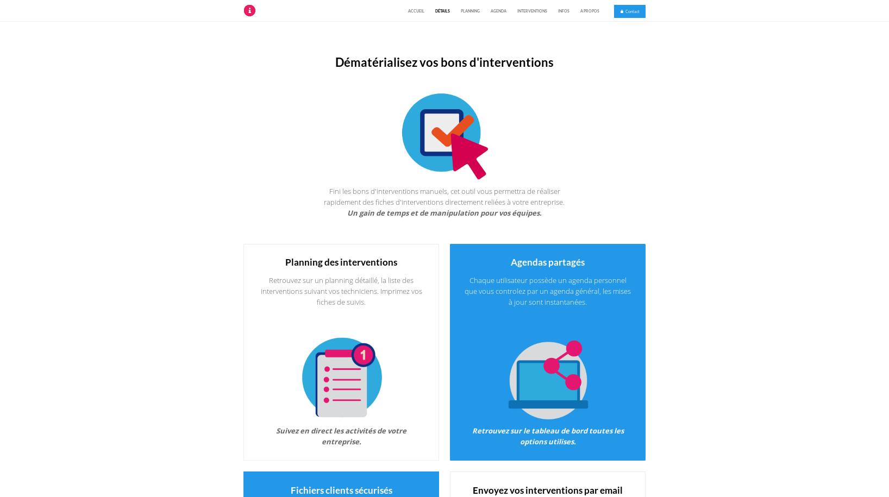

    

        

            <h2>Vos interventions en ligne.</h2>
            
Interventionenligne.fr est un logiciel de partage d'activité et de planning.

            
Il permet de travailler à distance dans la maintenance technique et la gestion de votre fichier client.

        

        

            

                <h4>Contenus</h4>
                
Interventionsenligne.fr est un logiciel destiné à toutes les entreprises qui souhaitent dématérialiser leur activités d'interventions. 

                
Le logiciel intègre : 

                <ul>
                    <li>Un planning partagés de vos collaborateurs.</li>
                    <li>Les interventions de maintenance.</li>
                    <li>Les fiches clients mis à jour.</li>
                    <li>Prise de photos lié à l'intervention</li>
                    <li>Signature électronique</li>
                    <li>Envoi par email</li>
                    <li>Mise à jour des bases de données</li>
                </ul>
            

        

    

    

