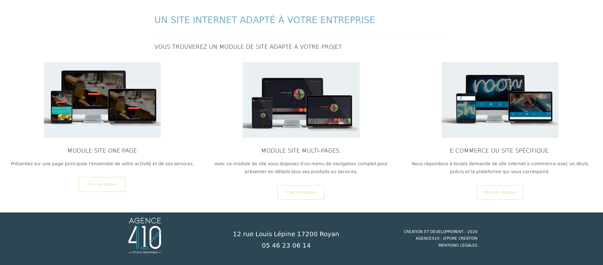

    

        

            <h2>Collaboration Agence 410.</h2>
            
O Pure Création travaille en collaboration sur Saintes et Royan pour le développement de site internet avec Panel Pub et Agence 410

        

        

            

                <h4>Information</h4>
                
O'Pure création travaille depuis 1 an avec les équipes de l'Agence 410 et de Panel Pub à Royan et Saintes.

                
Ensemble nous partageons nos compétences pour présenter de nouveaux modules de sites internet spcifiques pour les commerçants et les artisans.

                <ul>
                    <li>Module de site One Page.</li>
                    <li>Module de site Multi Pages</li>
                    <li>Module de site E Commerce ou autres....</li>
                </ul>
         
            

        

    

    

