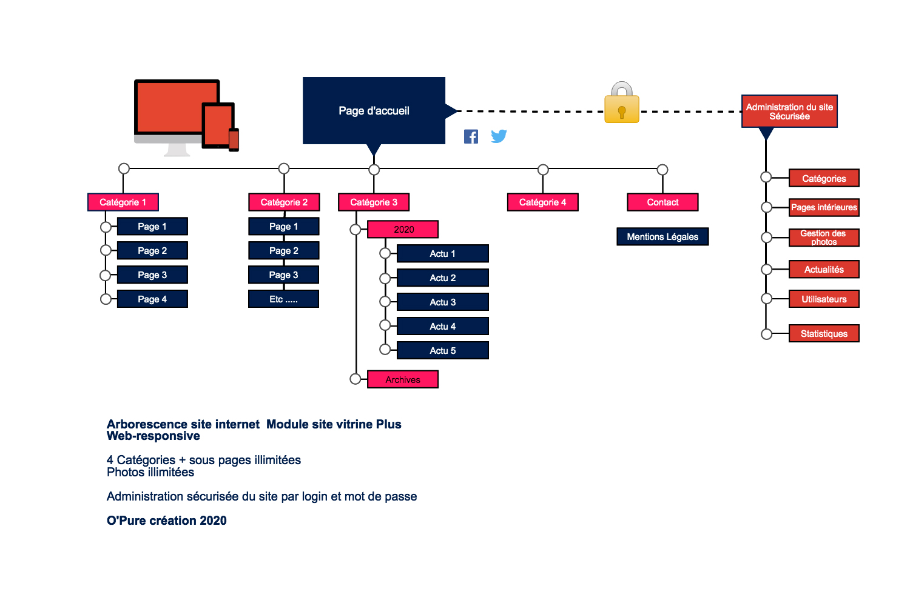

    

        

            <h2>Composition.</h2>
            
Ce module vous permettra de promouvoir votre activité sur internet de manière simple et efficace.

            
Les différentes catégories vous permettent de présenter une entreprise dans sa globalité ou de rentrer dans les détails d’un produit, d’un service, ou d’une activité plus précise.

        

        

            

                <h4>Eléménts principaux</h4>
                <ul>
                <li>5 pages principales ainsi q'un nombre illimité de sous pages, permettant de présenter une entreprise dans sa globalité ou de détailler un produit, un service, une activité.</li><li>Webdesign réalisé sur Photoshop suivant la charte graphique de l'entreprise.</li>
                <li>Site internet Web-Responsive permettant de s'adapter sur tous vos écrans (PC, Tablette, Smartphone).</li>
                <li>Un système d'administration (CMS) permet de modifier les contenus du site très facilement.</li>
                <li>Un référencement naturel efficace</li>
                <li>Module principal de site vitrine, possibilité de rajouter des modules en options*</li>
            </ul>
            

        

    

    

    

        

            <h2>Options*.</h2>
        

        

            

               <ul>
                <li>Module Multilangue.</li>
                <li>Module espace privé et sécurisé.</li>
                <li>Module panier E-commerce.</li>
                <li>Module Chat en direct.</li>
                <li>Module de Newsletter.</li>
                <li>Module pour Agenda partagé et prise de rendez vous.</li>
                <li>Module de recherche interne.</li>
               </ul>
            

        

    

