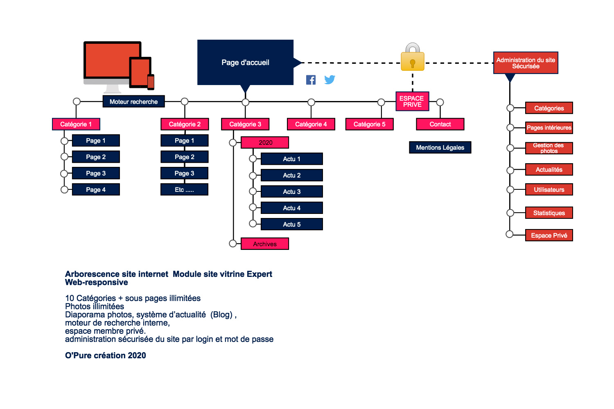

    

        

            <h2>Composition.</h2>
        

        

            

                
10 pages principales ainsi q'un nombre illimité de sous pages, permettant de présenter une entreprise dans sa globalité ou de détailler un produit, un service une activité.

                
Un système d'administration (CMS) permet de modifierles contenus du site très facilement.

                
Un référencement naturel efficace

                
Modules de diaporama photo, système d'actualité (Blog), moteur de recheche interne, espace privé*

                
Site Web-Responsive (PC - Tablette - Smartphone)

            

        

    

    

