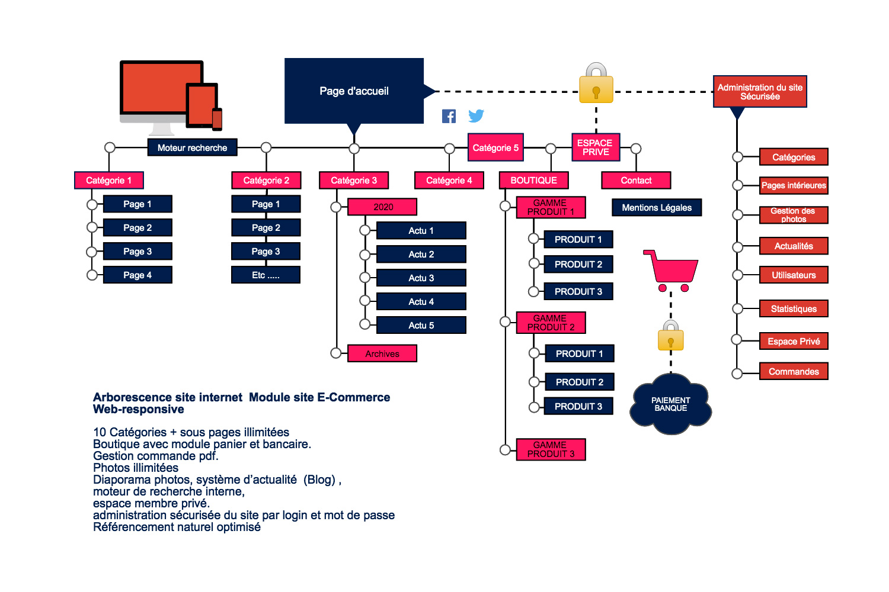

    

        

            <h2>Composition.</h2>
        

        

            

                
Un Nombre de pages principales illimitées suivant l’activité permettent de construire votre boutique en ligne et de promouvoir rapidement vos produits ou services.

Un système d’administration permet de modifier certain élément du site très facilement..

                
Diaporama photos, moteur de recherche interne, espace membre privé

                
Un module de vente via PayPal, module bancaire ou virement.

                
Page produit avec description détaillée.

            

        

    

    

        

    

